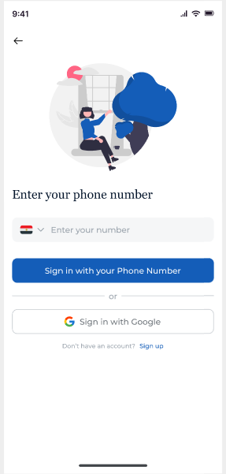
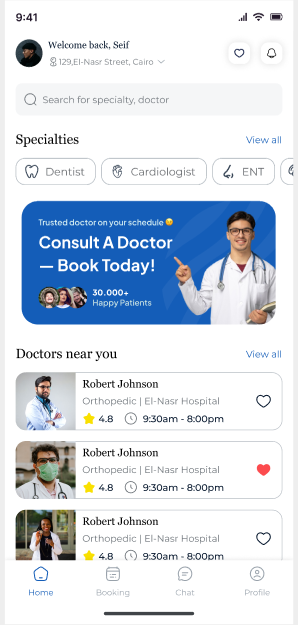
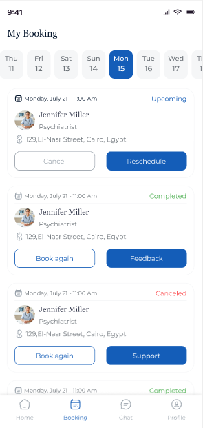
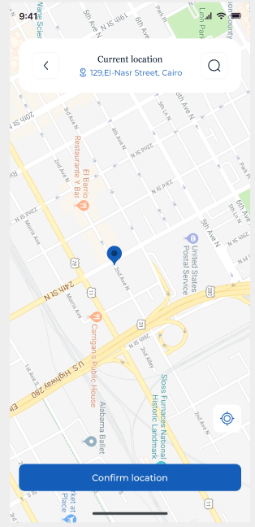
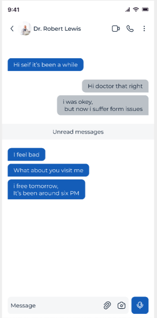

# Cure – Doctor Booking App 🩺📱

Cure is a mobile application for booking doctors, viewing doctor details, and managing medical appointments with an easy and clean UI.

> This project is part of my personal work on a complete doctor booking flow including authentication, booking, maps, and notifications.

---

## ✨ Features

- 🔐 **Authentication**
  - Email & password login / signup (update if different)
  - Persistent login session
  - Form validation and error handling

- 📅 **Booking System**
  - Browse available doctors/specialities
  - View available time slots
  - Book / cancel appointments
  - View upcoming & past bookings

- 👨‍⚕️ **Doctor Details**
  - Doctor name, speciality, rating, price, and bio
  - Clinic / hospital location
  - Available working hours
  - Option to book directly from doctor details screen

- 🗺️ **Maps Integration**
  - Show clinic location on map
  - Open location in external maps app (Google Maps, etc.)
  - (Update this section with your exact behavior)

- 💬 **Chat**
  - Real-time chat between patient and doctor
  - Supports sending and receiving messages instantly
  - Conversation history saved for each booking

---

## 🖼 Screenshots
| Splash | Onboarding |
|--------|------------|
|  |  |

| Auth | Home | Doctor Details |
|------|----------------|----------------|
|  |  |  |

| Booking | Map | Chats |
|---------|-----|---------------|
|  |  |  |

> Make sure the file names in the `screenshots` folder match the ones used above.

---

## 🛠 Tech Stack

- **Framework:** Flutter (Dart)  
- **Architecture:** (MVVM / Clean Architecture / BLoC)  
- **State Management:** (BLoC)  
- **Backend / Auth:** (REST API)  
- **Database / Storage:** (Hive / sharedPrefrence)  
- **Maps:** (Google Maps SDK)  
- **Notifications:** (flutter_local_notifications)

> Update this section to exactly match what you used so anyone reading your code understands your choices.

---

## 🚀 Getting Started

### Prerequisites

- Flutter SDK installed
- Android Studio or VS Code
- A valid API key for maps (if required)
- Firebase project / backend config (if used)

### Installation

```bash
# Clone the repository
git clone https://github.com/MohamedElshafei66/Cure.git

cd Cure

# Get dependencies
flutter pub get

# Run the app
flutter run
